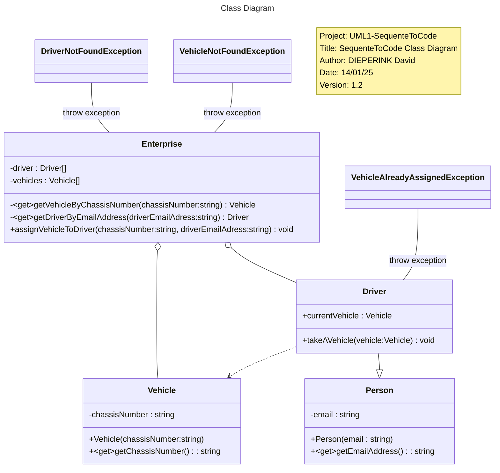

# Diagramme de class

```mermaid
---
title: Class Diagram
---
classDiagram
    note "Project: UML1-SequenteToCode
    Title: SequenteToCode Class Diagram
    Author: DIEPERINK David
    Date: 14/01/25
    Version: 1.2"

    class Driver {
        +currentVehicle : Vehicle

        +takeAVehicle(vehicle:Vehicle) void
    }

    class Person {
        -email : string
        +Person(email : string)
        +~get~getEmailAddress() : string
    }

    class Vehicle {
        -chassisNumber : string

        +Vehicle(chassisNumber:string)
        +~get~getChassisNumber() : string
    }

    class Enterprise {
        -driver : Driver[]
        -vehicles : Vehicle[]


        -~get~getVehicleByChassisNumber(chassisNumber:string) Vehicle
        -~get~getDriverByEmailAddress(driverEmailAdress:string) Driver
        +assignVehicleToDriver(chassisNumber:string, driverEmailAdress:string) void
    }

    class DriverNotFoundException { }

    class VehicleNotFoundException { }

    class VehicleAlreadyAssignedException { }

    Enterprise o-- Vehicle
    Enterprise o-- Driver
    Driver --|> Person
    Driver ..> Vehicle

    VehicleAlreadyAssignedException -- Driver : throw exception
    DriverNotFoundException -- Enterprise : throw exception
    VehicleNotFoundException -- Enterprise : throw exception
```
