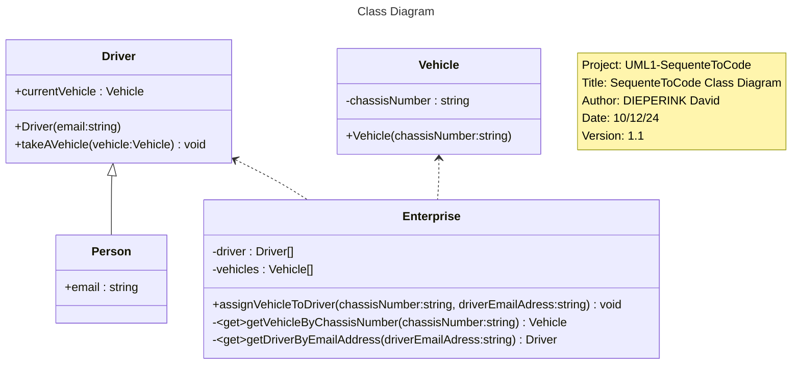

# Diagramme de class

```mermaid
---
title: Class Diagram
---
classDiagram
    note "Project: UML1-SequenteToCode
    Title: SequenteToCode Class Diagram
    Author: DIEPERINK David
    Date: 10/12/24
    Version: 1.1"

    class Driver {
        +currentVehicle : Vehicle

        +Driver(email:string)
        +takeAVehicle(vehicle:Vehicle) void
    }
    Driver <|-- Person

    class Person {
        +email : string
    }

    class Vehicle {
        -chassisNumber : string

        +Vehicle(chassisNumber:string)
    }

    class Enterprise {
        -driver : Driver[]
        -vehicles : Vehicle[]

        +assignVehicleToDriver(chassisNumber:string, driverEmailAdress:string) void
        -~get~getVehicleByChassisNumber(chassisNumber:string) Vehicle
        -~get~getDriverByEmailAddress(driverEmailAdress:string) Driver
    }

    Vehicle <.. Enterprise
    Driver <.. Enterprise
```
